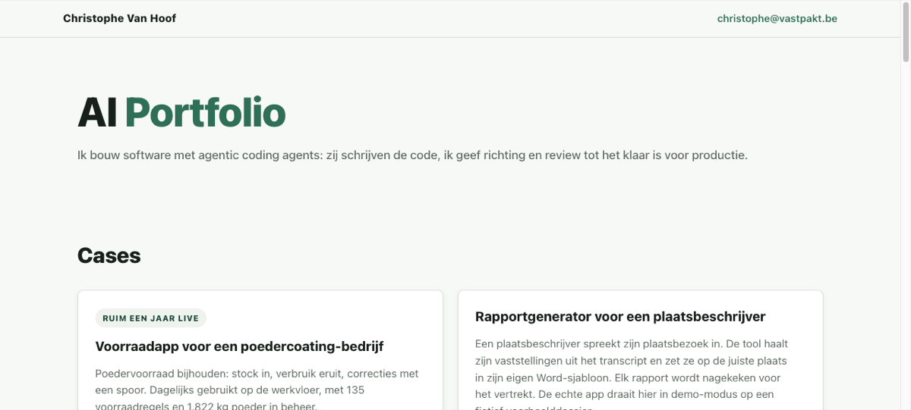

## Christophe Van Hoof

**AI & software engineer** — I build software with **agentic coding agents** (Claude Code, Codex): they write the code, I set direction and review until it's ready for production.

### Start here

1. **[vastpakt.be](https://vastpakt.be)** — portfolio with live demos  
2. **[Voorraadapp demo](https://app-production-32db.up.railway.app)** — production-style inventory app (fictional data)  
3. **[blood-values-dashboard](https://github.com/ChristopheAI/blood-values-dashboard)** — Laravel app: lab PDF → reviewed biomarkers (personal; not medical advice)  

### How I work
- Not AI autocomplete in a sidebar — **agents that build the codebase**
- Multiple agents when needed; I keep the direction
- Review until CI, tests, and production readiness check out — "done" is not vibes

### Stack
`Python` · `TypeScript` · `PHP/Laravel` · `PostgreSQL` · `Railway` · `Proxmox` · `Claude Code` · `Codex`

### Live work
| Project | What | Try it |
|---|---|---|
| **Portfolio** | Cases + how I work | [vastpakt.be](https://vastpakt.be) · [repo](https://github.com/ChristopheAI/vastpakt) |
| **Voorraadapp** (poedercoating) | Stock in/out, audit log — daily use in production (private codebase) | [Public demo](https://app-production-32db.up.railway.app) |
| **Rapportgenerator** | Transcript → Word report for a property expert | [Demo](https://plaatsbeschrijving-app-demo-production.up.railway.app) |
| **GTM / prospectie** | Signals → score → prepared outreach | [GTM demo](https://gtm-engine-demo-production.up.railway.app) · [Prospectie](https://app-production-5489.up.railway.app) |
| **Blood values dashboard** | Personal Laravel app: lab PDF → reviewed biomarkers, trends | [repo](https://github.com/ChristopheAI/blood-values-dashboard) |
| **Homelab** | Proxmox: apps + ops runbooks (public-safe docs) | [proxmox-homelab](https://github.com/ChristopheAI/proxmox-homelab) |

Client production systems stay private. Demos use fictional data only. Production work is often private; public GitHub is portfolio + selected systems.

### Background
- 2008–2024 hands-on IT (Cisco enterprise support, own IT firm with 50+ SME clients, field engineering)
- 2024–2025 B2B business development
- Homelab: Proxmox application ops ([proxmox-homelab](https://github.com/ChristopheAI/proxmox-homelab))

### Contact
- **Web:** [vastpakt.be](https://vastpakt.be)
- **Mail:** christophe@vastpakt.be
- **LinkedIn:** [christophewantstoconnect](https://www.linkedin.com/in/christophewantstoconnect)

<!-- profile-refresh: 2026-07-15-start-here -->
